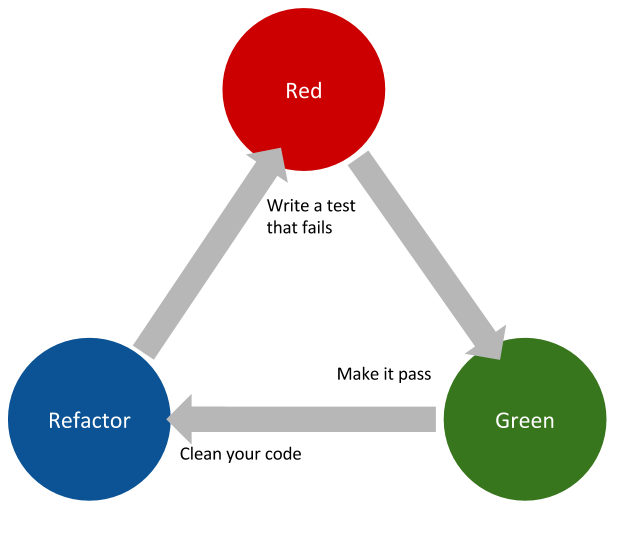

include::../../../_settings_deck.adoc[]
// include::../../../_settings_reveal.adoc[]

// beige, blond, default, moon, night, serif, simple, sky, solarized
// :revealjs_customtheme: reveal.js/css/theme/serif.css

= TDD

== TDD

* TDD
* Type of tests
* Testing in JS

== TDD

Test-driven development (TDD) is a software development process.

== Type of tests

- Unit tests
- Integration tests
- Functional tests

== Testing in JS

We will be using `tape` for testing.

[source,javascript,indent=0]
----
var test = require('tape');

test('My first test', function(t) {
  t.true(true, 'should work easily');
  t.end();
});
----

== Testing in JS

.Your First Test
[source,javascript,indent=0]
----
var test = require('tape');
var exercises = require('./exercises.js');

test('isString function', function(t) {
  t.test('when passed a string', function(t) {
    t.true(exercises.isString('hello'), 'should return true');
    t.end();
  });

  t.test('when passed an array', function(t) {
    t.false(exercises.isString([1, 2]), 'should return false');
    t.end();
  });
});
----
