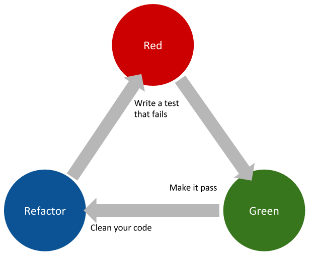

# Testing and Test Driven Development - TDD

### TDD

Test-driven development (TDD) is a software development process. This means that it's a method to write code.

It consists on developing in a small cycle.

Let's assume we have to write a function that calculates the distance between two cities.

This would be the process to solve this using the TDD process.

1. Write a test for the function, add all the edge cases you want to handle.
2. Run the tests. They will all fail.
3. Implement the function.
4. Run the tests. Until they are all working.
5. Refactor your code. Make your code cleaner, more readable and easier to understand.
6. Run the tests again to make sure they are still passing.

In a following lesson you will learn how to write tests and run them.

### Type of tests

There are mainly 3 types of tests. Each of them focuses on testing a different aspect of your app or project.

**Unit tests**

With unit tests you want to make sure that each individual component of your project works as expected.

You try to test them in isolation of other components.

**Integration tests**

Unit tests are tested in isolation. With integration tests you want to test the integration among different components of your app.

This means testing that a whole feature or a bunch of components that are supposed to work together, do it correctly also in edge cases.

**Functional tests**

Functional tests are nothing about the implementation. They only tests that the end user gets what should be expected. No more, no less.

Primarily testing the user interface. Or the higher level of your project.
